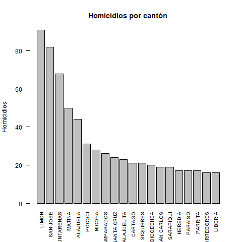

# Gráficos de delitos cometidos en Costa Rica en 2023
Este documentos muestra varios gráficos sobre delitos cometidos en Costa Rica en 2023.

**Fuente de los datos**: [Organismo de Investigación Judicial (OIJ)](https://sitiooij.poder-judicial.go.cr/index.php/ayuda/servicios-policiales/servicios-a-organizaciones/indice-de-transparencia-del-sector-publico-costarricense/datos-abiertos)

## Delitos por provincia

## Delitos por cantón

## Homicidios por cantón
